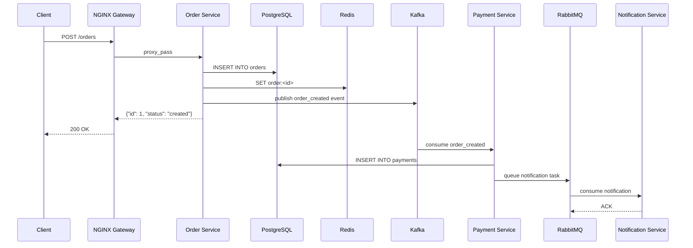

# Order Management System

A distributed order management system demonstrating platform and distributed systems patterns.

## Architecture

```
Client
  │
  ▼
NGINX (API Gateway)
  │
  ├── Order Service      → PostgreSQL + Redis + Kafka
  ├── Inventory Service  → PostgreSQL + Kafka
  ├── Payment Service    → PostgreSQL + RabbitMQ
  └── Notification Service → RabbitMQ
```

## Order Flow Sequence



## Directory Structure

```
microservices-platform/
├── platform/                    # Infrastructure services
│   ├── nginx/                   # NGINX API Gateway
│   ├── postgres/                # PostgreSQL database
│   ├── redis/                   # Redis cache
│   ├── kafka/                   # Apache Kafka
│   ├── rabbitmq/                # RabbitMQ message broker
│   ├── prometheus/              # Metrics collection
│   ├── grafana/                 # Visualization dashboard
│   ├── loki/                    # Log aggregation
│   ├── tempo/                   # Distributed tracing
│   ├── otel-collector/          # OpenTelemetry collector
│   ├── node-exporter/           # Node metrics exporter
│   ├── cadvisor/                # Container metrics
│   ├── kafka-ui/                # Kafka management UI
│   ├── redis-insight/           # Redis management UI
│   ├── pgadmin/                 # PostgreSQL management UI
│   ├── mailhog/                 # Email testing
│   ├── docker-compose.yml       # Infrastructure stack
│   └── scripts/                 # Start/stop/reset/seed scripts
├── services/
│   ├── order-service/           # Order management
│   ├── inventory-service/       # Inventory reservation
│   ├── payment-service/         # Payment processing
│   ├── notification-service/    # Notification dispatch
│   ├── traffic-generator/       # Locust load testing
│   └── shared-python-lib/       # Shared utilities
├── kubernetes/                  # Kubernetes manifests
│   ├── helm/                    # Helm charts
│   ├── ingress/                 # Ingress controllers
│   ├── gateway-api/             # Gateway API configs
│   ├── argocd/                  # GitOps deployment
│   ├── cert-manager/            # TLS certificates
│   ├── external-secrets/        # External secrets
│   └── service-mesh/            # Istio/Linkerd configs
└── infrastructure/
    └── terraform/               # Infrastructure as Code
```

## Prerequisites

- **Docker Desktop** — all services run in containers via 3 docker-compose files
- **Python 3.12+** — only needed to run unit tests locally (Docker handles dependencies inside containers)

## Quick Start

### Start infrastructure

```bash
cd platform
docker compose up -d
```

This starts PostgreSQL, Redis, Kafka, RabbitMQ, NGINX, Prometheus, Grafana, Loki, Tempo, and OpenTelemetry.

### Start all application services

```bash
cd services
docker compose up -d
```

This starts order-service, inventory-service, payment-service, and notification-service.

### Start traffic generator

```bash
cd traffic-generator
docker compose up -d
```

This starts Locust for load testing against the running services. Make sure the platform and services are already running. Open http://localhost:8089 to access the Locust web UI.

### Start everything (recommended)

```bash
cd platform
docker compose up -d
cd services
docker compose up -d
cd traffic-generator
docker compose up -d
```

Start infrastructure first, then services, then the traffic generator.

### Stop everything

```bash
cd traffic-generator
docker compose down
cd services
docker compose down
cd platform
docker compose down
```

### Stop services

```bash
cd services
docker compose down
```

### Stop infrastructure

```bash
cd platform
docker compose down
```

### Stop traffic generator

```bash
cd traffic-generator
docker compose down
```

### Restart services

```bash
cd services
docker compose restart
```

### Check status

```bash
cd services
docker compose ps
```

### Follow logs (all services)

```bash
cd services
docker compose logs -f
```

### Follow logs (one service)

```bash
cd services
docker compose logs -f order-service
```

### Rebuild a service

```bash
cd services
docker compose build order-service
docker compose up -d order-service
```

## Services

| Service | Port | Description |
|---------|------|-------------|
| PostgreSQL | 5432 | Primary database |
| Redis | 6379 | Cache |
| NGINX | 80 | API Gateway |
| Kafka | 9092 | Event streaming |
| Kafka REST | 8082 | Kafka HTTP proxy |
| RabbitMQ | 5672 | Message queue |
| Prometheus | 9090 | Metrics |
| Grafana | 3000 | Dashboard |
| Loki | 3100 | Log aggregation |
| Tempo | 3200 | Distributed tracing |
| OpenTelemetry | 4317 | Trace/metric ingestion |

## Concepts demonstrated

- Docker & Docker Compose
- Reverse proxy (NGINX)
- Health checks
- Metrics (Prometheus)
- Caching (Redis)
- Event streaming (Kafka)
- Message queues (RabbitMQ)
- Distributed tracing (OpenTelemetry)
- Service discovery
- Circuit breaker
- Retry logic
- Idempotency
- CQRS
- Saga pattern
- Outbox pattern

## API Testing vs Load Testing

This project uses different tools for different stages of development and platform validation. Each tool has a specific purpose.

### Tool Comparison

| Tool | Purpose | When to Use |
|------|---------|-------------|
| Postman | Develop and manually test APIs | During development |
| Locust | Simulate thousands of concurrent users | Load and scalability testing |
| k6 | Load, stress, and performance testing | CI/CD and performance regression testing |
| JMeter | Enterprise performance testing | Large enterprise environments |

### Postman

Postman is used to verify that an API behaves correctly.

Typical tasks include:

- Testing API endpoints
- Verifying request and response payloads
- Checking authentication
- Validating status codes
- Debugging API behavior

Example:

```
POST /orders

Expected response:

200 OK
```

Postman answers questions like:

- Does the API work?
- Is the response correct?
- Is authentication configured properly?
- Are validation errors handled correctly?

### Why Postman Is Not Enough

Postman is not designed to simulate production traffic.

It cannot realistically test scenarios such as:

- 500 concurrent users placing orders
- Kubernetes Horizontal Pod Autoscaling (HPA)
- Kafka message throughput
- Redis cache hit ratio
- PostgreSQL connection pool exhaustion
- RabbitMQ queue growth
- Prometheus metrics under sustained load

These require continuous, concurrent traffic over time.

### Locust

Locust is the primary traffic generator for this project.

It simulates realistic user behavior by continuously generating requests.

Example user actions:

- Create an order
- View an order
- Cancel an order
- Check inventory

Locust helps validate:

- Load balancing
- Kubernetes autoscaling
- Redis caching
- Kafka producers and consumers
- RabbitMQ workers
- Database performance
- API Gateway throughput
- Circuit breakers
- Retry behavior
- Distributed tracing

### k6 (Optional)

k6 is intended for automated performance testing.

Typical use cases include:

- Smoke tests
- Load tests
- Stress tests
- Spike tests
- Performance regression testing
- CI/CD pipelines

Unlike Locust, k6 is commonly integrated into automated deployment workflows to ensure performance remains stable across releases.

### Recommended Workflow

```
Development
      │
      ▼
Postman
      │
Verify API Correctness
      │
      ▼
Docker Compose
      │
      ▼
Kubernetes
      │
      ▼
Locust
      │
Generate Realistic Traffic
      │
      ▼
Prometheus / Grafana / Loki / Tempo
      │
      ▼
Observe Platform Behaviour
```

### What We Want to Observe

Using Locust and the platform infrastructure, we can evaluate:

- API response times
- Requests per second
- Error rates
- CPU and memory usage
- Kubernetes autoscaling
- Redis cache hit ratio
- PostgreSQL connection pool usage
- Kafka throughput and consumer lag
- RabbitMQ queue depth
- Distributed traces
- Structured logs
- Prometheus metrics
- Circuit breaker behavior
- Retry logic
- Dead Letter Queue processing

### Tool Usage Summary

| Phase | Tool |
|-------|------|
| API Development | Postman |
| Functional Testing | Postman |
| Local Load Testing | Locust |
| Platform Validation | Locust |
| Performance Regression | k6 |
| Continuous Integration (Optional) | k6 |

### Project Recommendation

For this project:

- **Postman** is used to manually develop and validate APIs.
- **Locust** is the primary traffic generator used to simulate realistic user behavior and exercise the platform.
- **k6** can be added later to automate performance testing as part of the CI/CD pipeline.

This combination provides a practical workflow that reflects how modern platform engineering teams develop, validate, and operate distributed systems.

## Suggested Learning Order

Build incrementally — don't install everything on day one:

1. Docker Compose
2. PostgreSQL
3. Redis
4. NGINX
5. Prometheus
6. Grafana
7. Kafka
8. RabbitMQ
9. Locust
10. OpenTelemetry
11. Loki
12. Tempo (or Jaeger)
13. Kubernetes
14. Helm
15. Argo CD
16. Terraform (or OpenTofu)
17. MinIO
18. cert-manager
19. HashiCorp Vault
20. Istio or Linkerd
21. Chaos Mesh

This progression mirrors how many organizations evolve their platforms: start with core infrastructure and observability, then add orchestration, automation, security, and advanced traffic management.